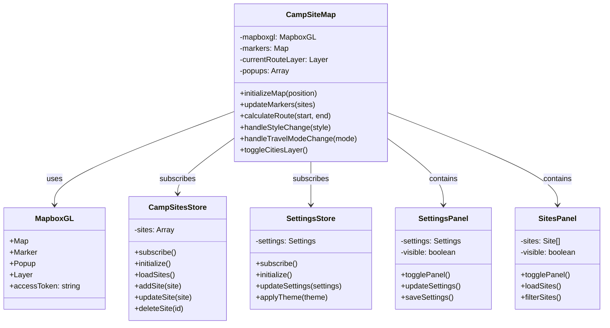
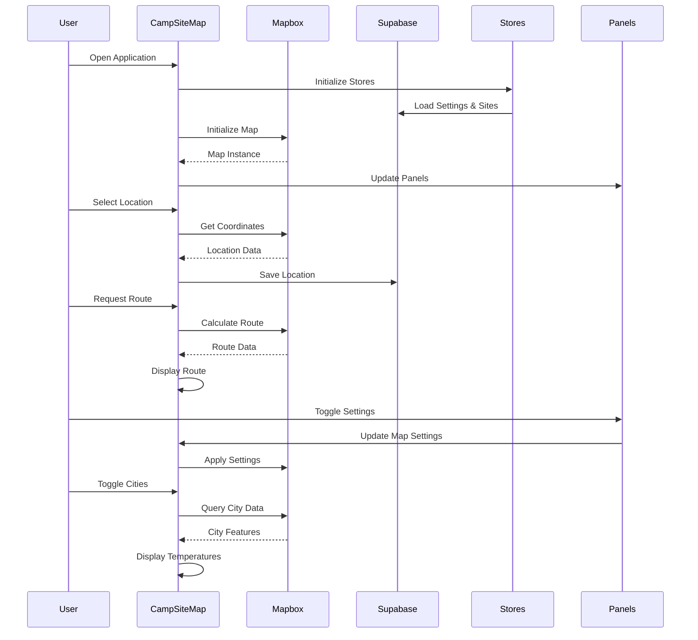
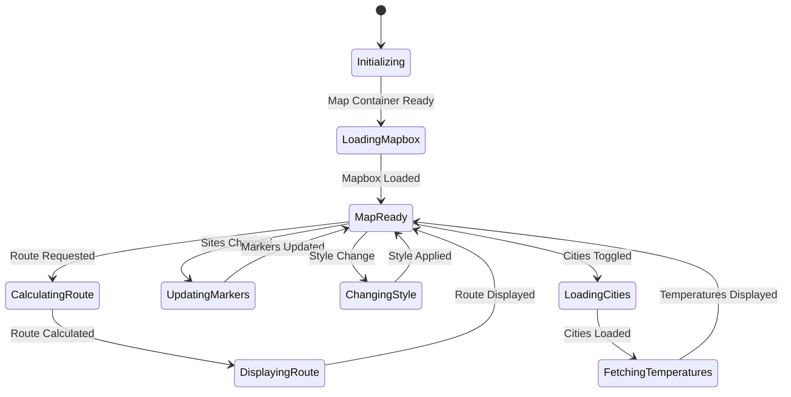

# Project Architecture

## Component Diagram

```mermaid
classDiagram
    class CampSiteMap {
        -mapboxgl: MapboxGL
        -markers: Map<string, Marker>
        -currentRouteLayer: Layer
        -popups: Array<Popup>
        +initializeMap(position)
        +updateMarkers(sites)
        +calculateRoute(start, end)
        +handleStyleChange(style)
        +handleTravelModeChange(mode)
        +toggleCitiesLayer()
    }

    class MapboxGL {
        +Map
        +Marker
        +Popup
        +Layer
        +accessToken: string
    }

    class CampSitesStore {
        -sites: Array<Site>
        +subscribe()
        +initialize()
        +loadSites()
        +addSite(site)
        +updateSite(site)
        +deleteSite(id)
    }

    class SettingsStore {
        -settings: Settings
        +subscribe()
        +initialize()
        +updateSettings(settings)
        +applyTheme(theme)
    }

    class SettingsPanel {
        -settings: Settings
        -visible: boolean
        +togglePanel()
        +updateSettings()
        +saveSettings()
    }

    class SitesPanel {
        -sites: Site[]
        -visible: boolean
        +togglePanel()
        +loadSites()
        +filterSites()
    }

    CampSiteMap --> MapboxGL : uses
    CampSiteMap --> CampSitesStore : subscribes
    CampSiteMap --> SettingsStore : subscribes
    CampSiteMap --> SettingsPanel : contains
    CampSiteMap --> SitesPanel : contains
```

## Sequence Diagram

```mermaid
sequenceDiagram
    participant U as User
    participant CM as CampSiteMap
    participant MB as Mapbox
    participant DB as Supabase
    participant S as Stores
    participant P as Panels

    U->>CM: Open Application
    CM->>S: Initialize Stores
    S->>DB: Load Settings & Sites
    CM->>MB: Initialize Map
    MB-->>CM: Map Instance
    CM->>P: Update Panels
    
    U->>CM: Select Location
    CM->>MB: Get Coordinates
    MB-->>CM: Location Data
    CM->>DB: Save Location
    
    U->>CM: Request Route
    CM->>MB: Calculate Route
    MB-->>CM: Route Data
    CM->>CM: Display Route

    U->>P: Toggle Settings
    P->>CM: Update Map Settings
    CM->>MB: Apply Settings

    U->>CM: Toggle Cities
    CM->>MB: Query City Data
    MB-->>CM: City Features
    CM->>CM: Display Temperatures
```

## State Diagram

```mermaid
stateDiagram-v2
    [*] --> Initializing
    Initializing --> LoadingMapbox: Map Container Ready
    LoadingMapbox --> MapReady: Mapbox Loaded
    
    MapReady --> CalculatingRoute: Route Requested
    CalculatingRoute --> DisplayingRoute: Route Calculated
    DisplayingRoute --> MapReady: Route Displayed
    
    MapReady --> UpdatingMarkers: Sites Changed
    UpdatingMarkers --> MapReady: Markers Updated
    
    MapReady --> ChangingStyle: Style Change
    ChangingStyle --> MapReady: Style Applied

    MapReady --> LoadingCities: Cities Toggled
    LoadingCities --> FetchingTemperatures: Cities Loaded
    FetchingTemperatures --> MapReady: Temperatures Displayed
```
